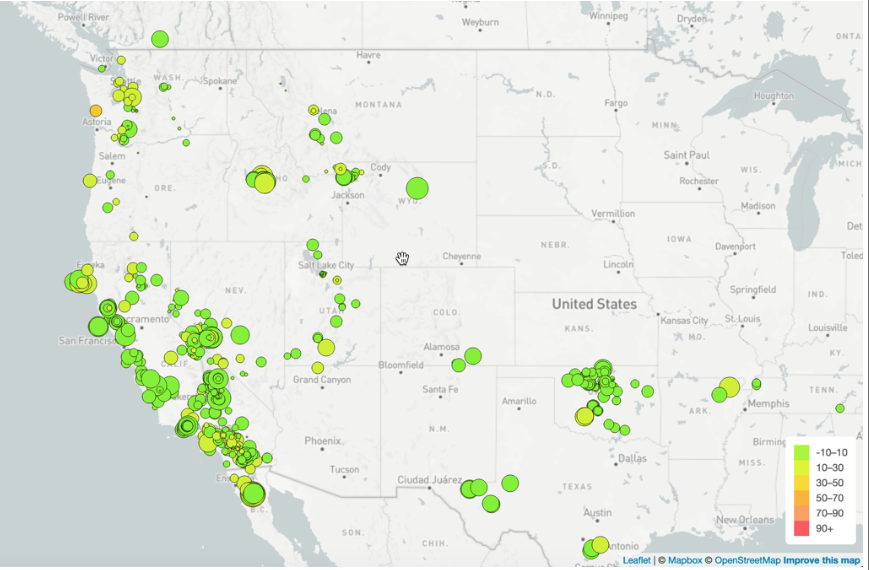
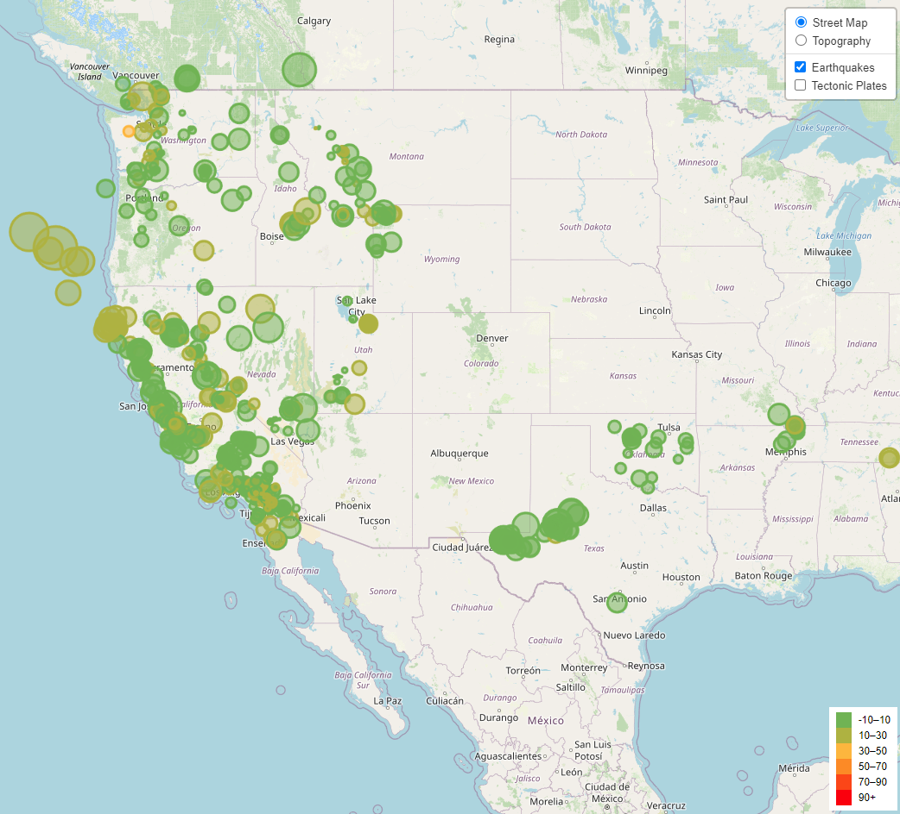

# Leaflet-challenge
Background

The United States Geological Survey, or USGS for short, is responsible for providing scientific data about natural hazards, the health of our ecosystems and environment, and the impacts of climate and land-use change. Their scientists develop new methods and tools to supply timely, relevant, and useful information about the Earth and its processes.

The USGS is interested in building a new set of tools that will allow them to visualize their earthquake data. They collect a massive amount of data from all over the world each day, but they lack a meaningful way of displaying it. In this challenge, you have been tasked with developing a way to visualize USGS data that will allow them to better educate the public and other government organizations (and hopefully secure more funding) on issues facing our planet.

The instructions for this activity are broken into two parts:

Part 1: Create the Earthquake Visualization

Part 2: Gather and Plot More Data (Optional)

In this challenge I used the dataset from the USGS GeoJSON feed via url: https://earthquake.usgs.gov/earthquakes/feed/v1.0/summary/all_week.geojson (all earthquakes over the Past 7 days).
Using Leaflet, I create a map that plots all the earthquakes from the dataset based on their longitude and latitude, included popups that provide additional information about earthquakes when its associated marker is clicked, created a legend that provides context for the map data, and resembles the example visualization:

Challenge Example:

My Example:

I also added a control that can add/remove Street Map, Topography, Earthquakes, and Tectonic Plates.
